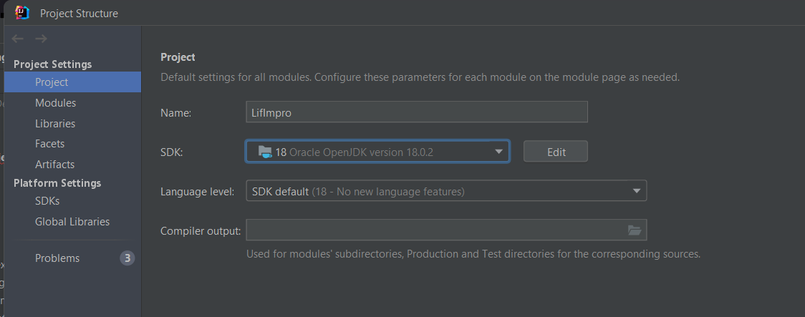
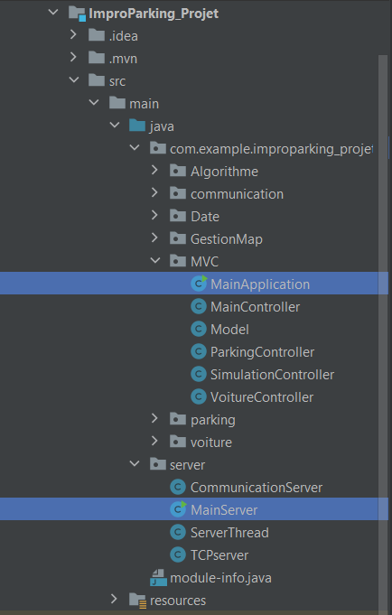

# PARKING SIMULATOR 2023
### lifprojet

## Description
Ce projet à pour but de simuler le fonctionnement de parkings et voitures intelligente. Ceci en intégrant un système de négociation entre les différentes parties et modéliser le déplacement des voitures vers le parking qu'elle a choisie. Le projet à été réalisé dans le cadre du LIFRPROJET, UE de l'université Lyon 1 uniquement à titre éducatif.

## IDE recommandé
Pour faire fonctionner ce projet JAVA, nous vous recommendons d'installer Intellij qui est un IDE proposé par JetBrain.
Lien d'installation : https://www.jetbrains.com/fr-fr/idea/download/#section=windows

## Ajouter le SDK
Pour le bon fonctionnement du projet, il faut ajouter la JDK 18 au projet. Pour cela, télécharger la ici : https://jdk.java.net/18/
Puis dans l'interface de Intellij : File > Project Structure (ou Ctrl+Maj+Alt+S). Dans Project Setting > Project ajoutez le chemin d'acccès au fichier de la JDK dans la ligne SDK comme ceci :

Puis validez et attendez que le compileur finisse (indication en bas à droite de l'IDE).

## Démarrage de l'application
Pour démarrer l'application, il faut démarrer MainServeur puis MainApplication, dans ce sens car le serveur dois être en marche avant l'application en elle-même.
* MainServer est dans le package server > MainServer.java
* MainApplication est dans le package improparking_projet > MVC > MainApplication.java

Pour démarrer un main appuyez sur la flèche verte en haut à droite de l'IDE.

L'application devrait maintenant fonctionner !
